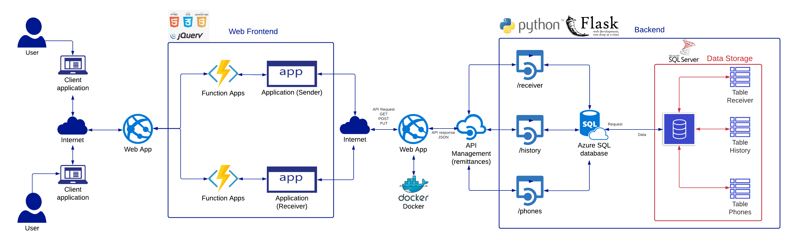
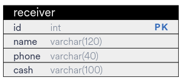
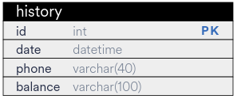
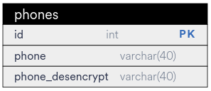
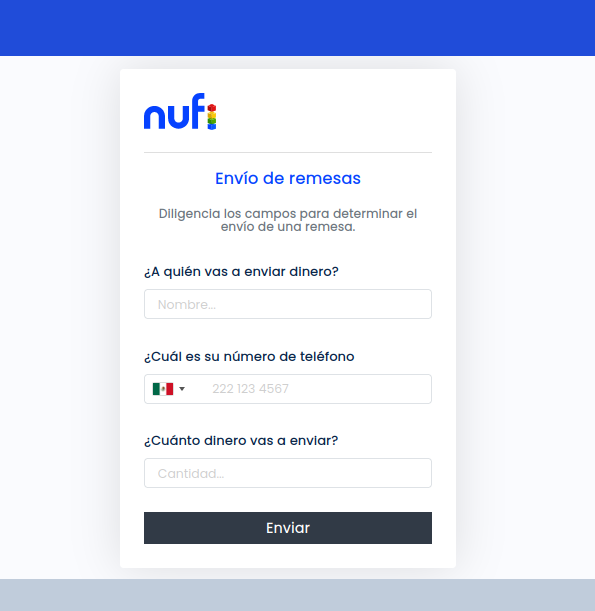
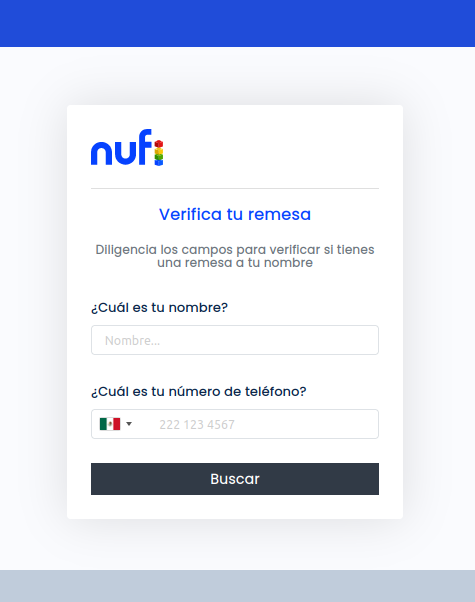
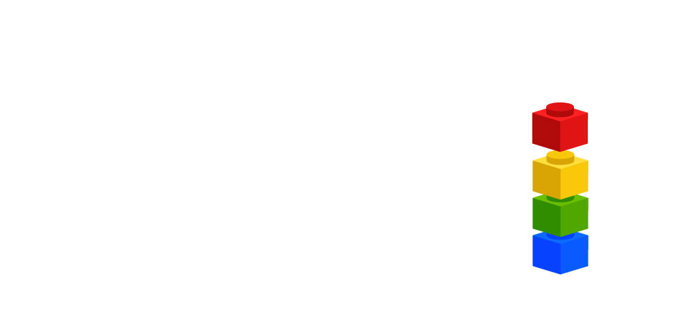
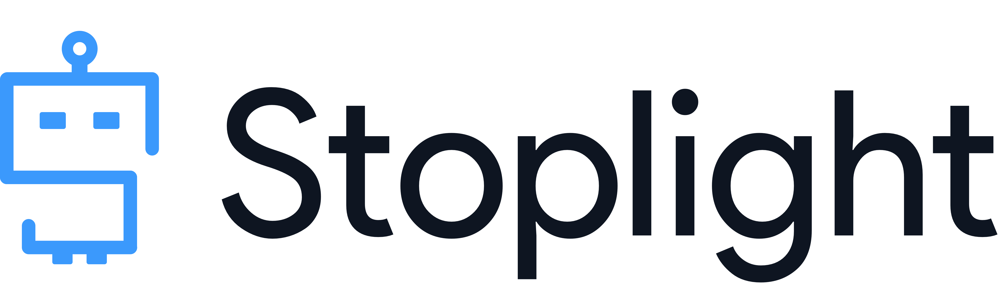

# Remittances as a Service

> [Here](https://github.com/Team-capstone-machines/api-remittances) is the link to the "API-remittances" repository.

## File organization :open_file_folder:

| FILE | DESCRIPTION |
|--|--|
| app.py | The flask application consuming an API |
| function_help.py | Helper functions to encrypt phone, convert number to integer, verify number and delete GMT |
| requirements.txt | File containing the list of dependencies necessary for the correct operation of the application |

Inside the "templates" folder you will find the .html files. Within the "static" folder there are three subfolders:
  - In "images" are the images that are displayed in the web application.
  - In "scripts" there are two Javascript files that correspond dynamic elements to the "cash" and "phone" fields.
  - In "styles" are the .css files, which give the style to the web application.

## Architecture :computer:

In this project we have implemented the REST -Representational State Transfer- architectural style, which has three key elements:

- **Client**, which runs on the computer.
- **Server**, which offers an API as a means of accessing its data or features.
- **Resource**, part of the content that the server can provide to the client. For the client to gain access to a resource, the client sends an _HTTP request_, and the server generates an _HTTP response_ with data encoded with the resource.

The REST request structure contains:

- An HTTP method (POST, GET, PUT or DELETE), also called CRUD operations.
- An endpoint containing a URI (Uniform Resource Identifier) which indicates where and how to find the resource on the Internet.
- Headers that store information relevant to the client and server such as authentication data, API key, IP address and response format information.
- A body to transmit additional information to the server.

The structure of the REST response that is sent from the server is a representation of the requested resource. The format we use this time is JSON.

We have created an API for the remittance service that has three endpoints /receiver, /history and /phones. For this API we need a Receiver model, a History model and Phones model. All the API documentation can be consulted [https://themachines.stoplight.io/settings/remittances-as-a-service](here)

### Deploy :rocket:
The application has been deployed remotely thanks to a Microsoft Azure web apps instance.

## Data Model :pencil:
The database management is with Azure SQL Database. The creation, maintenance and access to table information is done through SQL Server Management Studio (SSMS), an extension of VSC.

 

## Views :money_with_wings:
The application has two user interfaces: sender and receiver, each with different purposes.

**View Sender:**

  

**View receiver:**

## Landing page :mag_right:
Visit the project landing page for more information about the project by clicking [here](https://www.canva.com/design/DAEuCKL5xcI/NHLreyvmFhi82IBAA-MgTg/view?website#2)

## Authors :registered:
:woman_technologist: **Diana Parra**
* [GitHub](https://github.com/dianaparr)
* [Twitter](https://twitter.com/dianaparra017)

:man_technologist: **Brian Zapata**
* [GitHub](https://github.com/brian-1989)
* [Twitter](https://twitter.com/BrianZa03390210)

:man_technologist: **Victor Cuartas**
* [GitHub](https://github.com/vicuartas230/)
* [Twitter](https://twitter.com/vicuartas230)

***

Project developed together with:
  

### Technologies and tools :zap:

  

   

***

2021 ©

