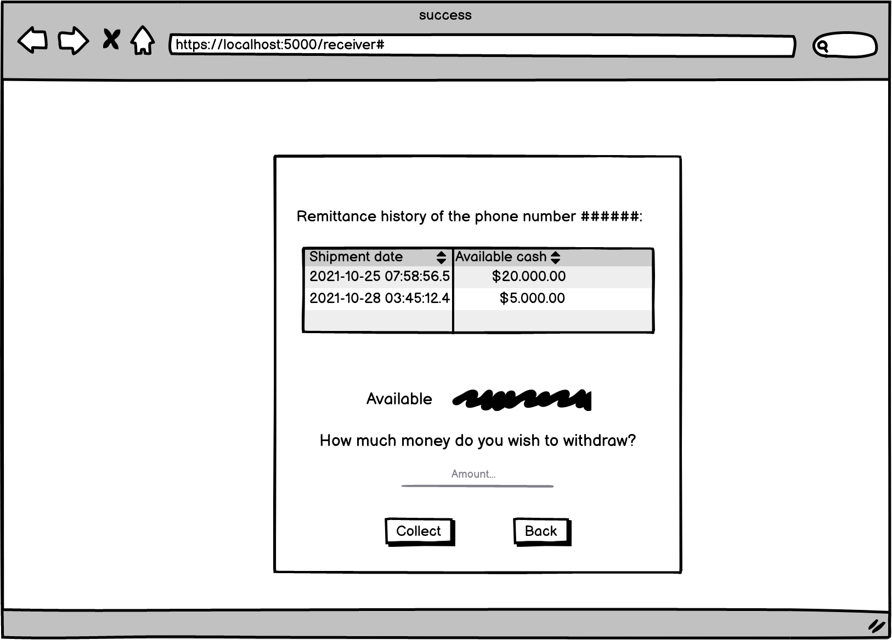

# REST API: Remittances as a Service

## Repository contents

| FILE | DESCRIPTION |
| ---- | ----------- |

  

**Folder: moldels**

## Technologies

**Front-end:**

- Javascript
- HTML/CSS

**Back-end:**

- Flask
- SQLAlchemy
- Python (OOP)

**Database:**

- PostgreSQL (Managed from Heroku)

## Architecture

In this project we have implemented the REST -Representational State Transfer- architectural style, which has three key elements:

- **Client**, which runs on the computer.
- **Server**, which offers an API as a means of accessing its data or features.
- **Resource**, part of the content that the server can provide to the client. For the client to gain access to a resource, the client sends an _HTTP request_, and the server generates an _HTTP response_ with data encoded with the resource.

The REST request structure contains:

- An HTTP method (POST, GET, PUT or DELETE), also called CRUD operations.
- An endpoint containing a URI (Uniform Resource Identifier) which indicates where and how to find the resource on the Internet.
- Headers that store information relevant to the client and server such as authentication data, API key, IP address and response format information.
- A body to transmit additional information to the server.

The structure of the REST response that is sent from the server is a representation of the requested resource. The format we use this time is JSON.

We have created an API for the remittance service that has two endpoints /receiver and /history. For this API we need a Receiver model and a History model. All the API documentation can be consulted [https://themachines.stoplight.io/docs/remittances-as-a-service/YXBpOjIzODcyNzA3-remittances](here)

### Endpoints

table here!

### Data Model

### Mockups

**View Sender:**

  

**Views receiver:**

_Receiver-success:_

*Receiver-success-back:*

*Receiver-success-fail:*

*Receiver-failed:*

## Authors :registered:
:woman_technologist: **Diana Parra**
* [GitHub](https://github.com/dianaparr)
* [Twitter](https://twitter.com/dianaparra017)

:man_technologist: **Brian Zapata**
* [GitHub](https://github.com/brian-1989)
* [Twitter](https://twitter.com/BrianZa03390210)

:man_technologist: **Victor Cuartas**
* [GitHub](https://github.com/vicuartas230/)
* [Twitter](https://twitter.com/vicuartas230)
